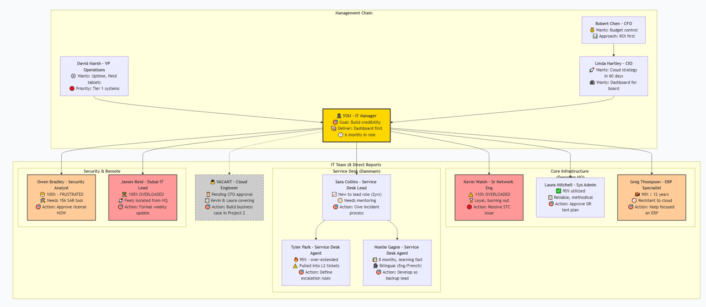

# IT Governance Framework — Gulf Horizon Energy

> A complete, production-ready IT governance framework for a 450-user Oil & Gas energy company with Dammam HQ, Dubai office, and 80 field engineers.

---

## Executive Summary

Gulf Horizon Energy (GHE) operates in a high-availability environment where ERP downtime directly impacts month-end financial close and field connectivity affects operational safety. This framework was built to address seven inherited problems discovered within the first 30 days of assuming the IT Manager role, including:

- ERP P1 incidents caused by uncontrolled Oracle jobs
- Three consecutive months of vendor SLA breaches (STC, Accenture, MSP)
- Critical NCA ECC compliance gap — terminated employees with active system access
- Untested ERP disaster recovery replica with broken failover scripts

Every deliverable in this repository solves a real, documented problem using actual GHE data, incidents, and vendor names.

---

## The Environment at a Glance

| Category | Detail |
|----------|--------|
| **Company** | Gulf Horizon Energy (GHE) — Oil & Gas Exploration & Production |
| **Headquarters** | Dammam, KSA |
| **Satellite Office** | Dubai, UAE |
| **Users** | 450 (including 80 field engineers) |
| **IT Team** | 9 (Dammam + Dubai) |
| **Active Vendors** | 6 (STC, Accenture, Local MSP, Fortinet, Dell, SAP) |
| **Critical Systems** | Oracle EBS, SAP, M365, SCADA interface, Azure tenant, MPLS WAN |

---

## Leadership & Reporting Structure

| Name | Title | Key Expectation |
|------|-------|----------------|
| Linda Hartley | CIO (3 months in) | Modern IT, cloud strategy, dashboard reporting |
| Robert Chen | CFO | Budget control, ROI before investment, no surprises |
| David Marsh | VP Operations | Field uptime, ERP availability, proactive communication |

---

## IT Team Structure

| Name | Role | Location | Key Responsibility |
|------|------|----------|---------------------|
| Kevin Walsh | Sr Network Engineer | Dammam | MPLS WAN, STC vendor management |
| Laura Mitchell | Systems Administrator | Dammam | Server infrastructure, DR execution |
| Greg Thompson | ERP Specialist | Dammam | Oracle EBS stability |
| Sara Collins | Service Desk Lead | Dammam | Incident management process |
| Tyler Park | Service Desk Agent | Dammam | L1/L2 escalation |
| Noelle Gagne | Service Desk Agent | Dammam | Documentation, bilingual support |
| Owen Bradley | Security Analyst | Dammam | Access reviews, NCA ECC compliance |
| James Reid | Dubai IT Lead | Dubai | Local operations, STC escalations |

---

## Visuals

### Incident Priority Matrix

### RACI Accountability Visual

### DR Failover Flow

### Vendor SLA Scorecard (March 2026)

### Security Controls Dashboard

---

## Deliverables

| # | Deliverable | File | Purpose |
|---|-------------|------|---------|
| D1 | Incident Management Process | `incident-management.md` | P1–P4 priority matrix, escalation paths, PIR requirements |
| D2 | Change Management Process + CAB Charter | `change-management.md` | Standard/Normal/Emergency changes, CAB governance |
| D3 | SLA Framework | `sla-framework.xlsx` | Service catalogue, monthly scorecard, penalty tracking |
| D4 | RACI Matrix | `raci-matrix.xlsx` | Role accountability for 12 core IT processes |
| D5 | Asset Lifecycle Register | `asset-register.xlsx` | Full asset inventory, CAPEX forecast, risk scoring |
| D6 | Disaster Recovery Plan | `dr-plan.md` | Tier 1/2/3 systems, RTO/RPO, DR test schedule |
| D7 | Vendor Governance Register | `vendor-register.xlsx` | Contract calendar, performance trends, breach action log |
| D8 | ISO 27001 / NCA ECC Control Mapping | `security-controls.xlsx` | Control implementation status, evidence, gaps |

---

## Key Incident Stories (The Reason This Framework Exists)

### INC-006 — ERP P1 Outage (1 March 2026)
Oracle EBS unresponsive for 90 minutes during month-end close. Root cause: orphan Oracle job from terminated employee (USR-022) — account still active 6 months after termination. This incident exposed three governance failures: access review, change management, and vendor SLA enforcement.

### INC-003 — Dubai VPN Outage (3 February 2026)
Full site-to-site VPN outage. Dubai office offline 45 minutes. STC routing table corruption following maintenance window with no change notification to GHE. Resolution took 5.2 hours vs 4-hour P1 SLA. Post-incident review was 47 days overdue when discovered.

---

## Compliance Alignment

| Framework | Status | Key Gaps Addressed |
|-----------|--------|---------------------|
| **ISO 27001** | Partial | Access Control (A.9), Patch Management (A.12), DR (A.17) — all remediated |
| **NCA ECC** | Partial | Technology & Operations domain — terminated accounts locked, access review tool approved |

---

## Technology Stack Referenced

- **ERP:** Oracle EBS, SAP
- **Cloud:** Azure (4 services, ERP DR replica)
- **Network:** MPLS WAN (STC), Fortinet firewalls
- **Monitoring:** PRTG, Veeam
- **Productivity:** Microsoft 365, Teams
- **Field Operations:** SCADA interface, field tablets (MSP-managed)

---

## Quick Links

- [Incident Management](incident-management.md)
- [Change Management](change-management.md)
- [Disaster Recovery Plan](dr-plan.md)
- [SLA Framework](sla-framework.xlsx)
- [RACI Matrix](raci-matrix.xlsx)
- [Asset Register](asset-register.xlsx)
- [Vendor Register](vendor-register.xlsx)
- [Security Controls](security-controls.xlsx)

---

## Interview Positioning

> "This framework is built on a live simulation of an Oil & Gas IT environment — real incidents, real vendor SLA breaches, real compliance gaps. I can walk you through any process using actual data."

---

*Gulf Horizon Energy — Simulated Environment | All data is fictional for portfolio purposes*